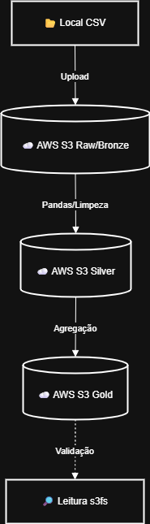

<p align="center">
  
</p>

# AWS S3 Medallion ETL Pipeline 🏅


Este projeto implementa um pipeline de Engenharia de Dados completo (ETL), movendo dados de um ambiente local para a nuvem AWS S3. O projeto segue a **Arquitetura Medalhão** (Bronze, Silver e Gold) para garantir qualidade, rastreabilidade e organização dos dados.

## 🏗 Arquitetura do Projeto

Abaixo, o fluxo de dados implementado:


<p align="center">
  
</p>

O fluxo de dados segue as seguintes etapas:

1.  **Ingestão (Local → Bronze):**
    - Upload de arquivos CSV brutos (Raw Data) para o bucket S3 na pasta `raw/`.
    - Garante backup e imutabilidade dos dados originais.

2.  **Processamento (Bronze → Silver):**
    - Leitura dos dados brutos.
    - Limpeza e padronização utilizando **Pandas**.
    - Adição de metadados (ex: data de ingestão).
    - Conversão para formato **Parquet** (colunar e comprimido) e upload para `silver/`.

3.  **Agregação (Silver → Gold):**
    - Leitura dos dados refinados (Parquet).
    - Aplicação de regras de negócio e agregações.
    - Criação de uma visão analítica pronta para consumo e upload para `gold/`.

4.  **Verificação:**
    - Validação dos dados diretamente na nuvem utilizando leitura via `s3fs` sem necessidade de download físico.

```
aws-s3-etl-medallion/
├── data/                  # Pasta local para entrada de arquivos CSV
├── main.py                # Script principal do pipeline ETL
├── pyproject.toml         # Gerenciamento de dependências (Poetry)
├── poetry.lock            # Versões travadas das bibliotecas
├── README.md              # Documentação do projeto
└── .env                   # Variáveis de ambiente (não versionado)
```

## 🛠 Tecnologias Utilizadas

- **Linguagem:** Python 3.11.12
- **Cloud:** AWS S3 (Simple Storage Service)
- **Manipulação de Dados:** Pandas
- **Formatos de Arquivo:** CSV, Parquet
- **Bibliotecas:** `boto3`, `s3fs`, `python-dotenv`, `pandas`

## 🚀 Como Executar
**Pré-requisitos**
- Python 3.11+ instalado.
- Poetry instalado.
- Conta na AWS com permissão de escrita no S3.

###  Passo a Passo
1. Clone o repositório:

```
git clone [https://github.com/diipdata/aws-s3-etl-medallion.git](https://github.com/diipdata/aws-s3-etl-medallion.git)
cd aws-s3-etl-medallion
```

2. Instale as dependências:
```
poetry install
```

3. Configure as credenciais: Crie um arquivo .env na raiz do projeto seguindo o exemplo:

```
AWS_ACCESS_KEY_ID=sua_chave
AWS_SECRET_ACCESS_KEY=sua_senha
AWS_REGION=us-east-1
BUCKET_NAME=nome-do-seu-bucket
```

4. Adicione dados: Coloque seus arquivos CSV na pasta *data/* na raiz do projeto.

5. Execute o pipeline:

```
poetry run python main.py
```

## Próximos Passos (Roadmap)
Este projeto serve como fundação para um Data Lake. As próximas evoluções planejadas são:

[ ] Migração para Cloud Native: Mover a execução do script local para uma função AWS Lambda, automatizando a execução sempre que um arquivo cair no bucket.

[ ] Data Quality: Implementar validações robustas (ex: Great Expectations ou Pandera) para garantir que dados corrompidos não cheguem à camada Silver.

[ ] Catalogação: Utilizar o AWS Glue Crawler para catalogar as tabelas Gold e permitir consultas via SQL (AWS Athena).

[ ] IaC (Infrastructure as Code): Criar os buckets e permissões automaticamente utilizando Terraform.

[ ] Dashboard: Conectar o Power BI ou QuickSight na camada Gold para visualização dos dados.

----


**Criado por [Diego](https://github.com/diipdata)**  
diegop.freitas@gmail.com | [LinkedIn](https://linkedin.com/in/diegop-freitas) | [X/Twitter](https://x.com/diipdata)

*Feito com ☕ e muitas linhas de código (e alguns erros pelo caminho).*